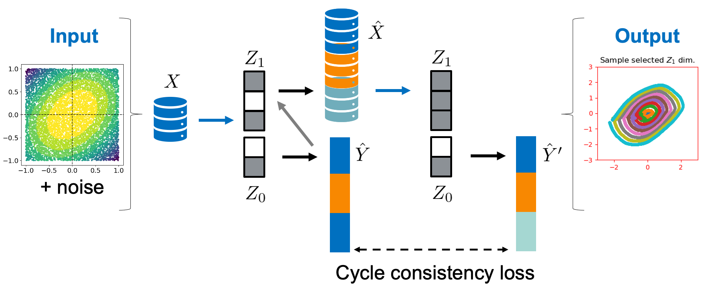

# Learning Conditional Invariance through Cycle Consistency
This repository provides a basic TensorFlow 1 implementation of the proposed model in our GCPR 2021 paper "Learning Conditional Invariance through Cycle Consistency".

Check out [our talk given at GCPR 2021](https://www.youtube.com/watch?v=wdbSLlmBTBI) (on Youtube) for an overview of the paper!



## Executing the Code

The developed code used the following dependencies:

```
  - python=3.6.12
  - matplotlib=3.3.2
  - tensorflow-gpu=1.14
```

You can install a corresponding environment with

```
conda env create -f requirements.yml
```

activate the environment

```
conda activate CondInvCC
```

and execute the script with


```
python main.py --mode train --experiment ellipse
```

for training our model in the ellipse setting.


## Pre-trained Models

We provide the pretrained models for the ellipse and ellipsoid experiment which you can 
execute with 

```
python main.py --mode test --experiment ellipsoid
```


## Reference

If you like our paper and use it for your research, please cite us.

```
@inproceedings{SamarinNesterov2021,
  title={Learning Conditional Invariance through Cycle Consistency},
  author={Samarin*, Maxim and Nesterov*, Vitali and Wieser, Mario and Wieczorek, Aleksander
   and Parbhoo, Sonali and Roth, Volker},
  booktitle={German Conference on Pattern Recognition},
  year={2021},
  organization={Springer}
}

```